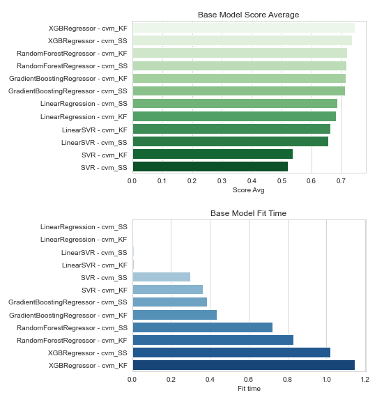
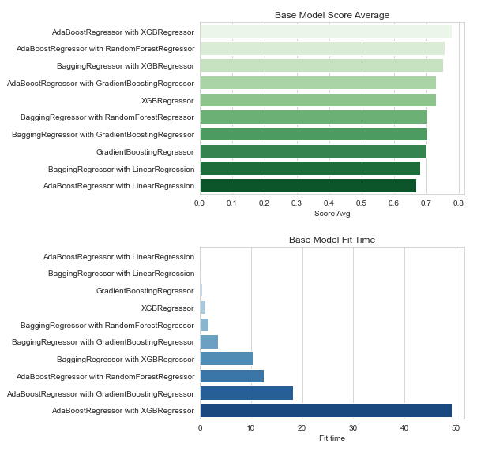

# Predicting Heart Disease Rate (PHDR)

## Table of Contents
1. [Overview](#overview)
2. [Project Notebooks](#project-notebooks)
    - Compressed Notebook
    - Detailed Notebook
    - Data Wrangling and EDA
    - Creating the Model
  
3. [Modeling Process with Results](#modeling-process-with-results)
4. [Recommendations and Future Considerations](#recommendations-and-future-considerations)

## Overview
The goal of this project is to predict the rate of heart disease (per 100,000 individuals) for any given county in the United States based on socioeconomic indicators scraped from the USDA ERS website.

According to NCHS figures from a 2018 study, heart disease was considered the leading cause of death in the U.S., claiming more than 650,000 American lives. The intention is that this model can be used to identify whether or not county administration needs to put more of a focus on heart-health in their communities. It can be a useful data-driven tool when deciding whether or not there need to be more facilities to help treat heart disease specific illnesses, or instill programs to better heart-health in their counties and school districts. Excellent examples of programs that are actively used in U.S. schools today are the [Kids Heart Challenge](https://www.heart.org/en/professional/educator/school-programs/elementary-schools) and [ShapeUpUS](https://shapeupus.org/hip-hop-healthy-heart-program-for-children/).

#### The target variable:
The target column for this dataset is labeled `heart_disease_mortality_per_100k` which is in the 'Training_labels.csv' file.

For more reference, you can access the original kaggle dataset here: [Predicting heart disease rate](https://www.kaggle.com/nandvard/microsoft-data-science-capstone).

## Project Notebooks
This project consists of four major notebooks:

* [Compressed Notebook](https://github.com/samdomeier/Springboard-projects/blob/master/Predicting_Heart_Disease_Rate/PHDR_compressed_notebook.ipynb)
  > The compressed notebook contains a shortened version of the "Detailed Notebook". It will include partial EDA, full data wrangling/cleaning, and only the final model with results.
  
* [Detailed Notebook](https://github.com/samdomeier/Springboard-projects/blob/master/Predicting_Heart_Disease_Rate/PHDR_detailed_notebook.ipynb)
  > This notebook contains everything in the "Data Wrangling and EDA" and "Creating the Model" notebooks. It includes every detail you will need to understand how this model was created. From EDA, to feature engineering, to fully detailing the modeling process.
  
* [Data Wrangling and EDA](https://github.com/samdomeier/Springboard-projects/blob/master/Predicting_Heart_Disease_Rate/PHDR_data_wrangling_and_EDA.ipynb)
  > This will have every step in the "Detailed Notebook" for the feature engineering.

* [Creating the Model](https://github.com/samdomeier/Springboard-projects/blob/master/Predicting_Heart_Disease_Rate/PHDR_creating_the_model.ipynb)
  > This will have every step in the "Detailed Notebook" for the model creation.

## Modeling Process with Results
I approached the modeling process into three steps:

1. Identify 5+ regressors that could be a potential fit for our model, and do a quick model evaluation with cross-validation. The models that were evaluated are listed below.

    - LinearRegression
    - LinearSVR
    - SVR
    - RandomForestRegressor
    - GradientBoostingRegressor
    - XGBRegressor

The results for this evalutation can be seen below.

  

2. Based on the outcome of step 1, select the best performing regressors to be used for ensamble modeling evaluation. The regressors selected are listed below.

    - LinearRegression
    - XGBRegressor
    - GradientBoostingRegressor 
    - RandomForestRegressor

The results for this evalutation can be seen below.

  

3. The final step involved hyperparameter tuning the top performing models from step 2 using RandomSearchCV and GridSearchCV. The results of these models can be seen below.

|  | Model Description	| Model Score	| Mean Fit Time (s)	| Std Fit Time |
| --- | --- | --- | --- | --- |
| BR_XGBR	| BaggingRegressor with XGBRegressor	| 0.777075	| 74.660406	| 0.786755 |
| ABR_RFR	| AdaBoostRegressor with RandomForestRegressor	| 0.762149	| 49.474793	| 1.124591 |
| XGBR	| XGBRegressor	| 0.761532	| 3.279330	| 0.118036 |
| GBR	| GradientBoostingRegressor	| 0.753177	| 2.304990	| 0.084161 |

## Recommendations and Future Considerations

Based on the results from my modeling, I've decided to recommend the `XGBRegressor` model. It is efficient and has a high accuracy in comparison to the other models.

**For future considerations**, I would look into recreating the database with actual FIPS (Federal Information Processing Standard, essentially county codes) codes so that I could correlate them to coordinates, and plot out a map of high risk areas using Folium to create a better story. If I really had time on my hands, I could gather the coordinates to specific heart disease facilities (hospitals, treatement centers, etc.) and identify which areas could use more resources for preventing and treating heart disease related illnesses.
