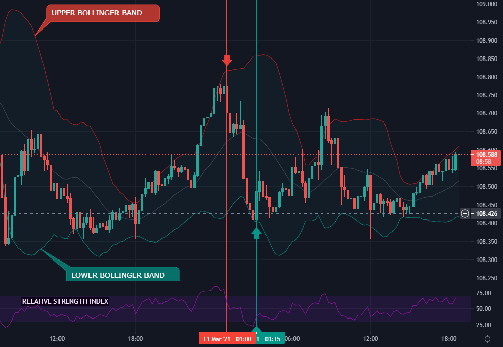
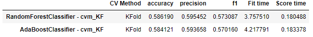

# Foreign Exchange Binary Classification Model for Trading

## Table of Contents
1. [Overview](#overview)
2. [The Data in Detail](#the-data)
3. [Project Notebooks](#project-notebooks)
    - Local Database Creation
    - Modeling and Results
    - Predictions
4. [Feature Engineering](#feature-engineering)
4. [Modeling Process and Results](#modeling-process-and-results)
5. [Conclusion and Future Considerations](#conclusion-and-future-considerations)

## Overview
The goal of this project is to try and create a binary classification model for trading foreign exchange currencies. This model was created for a style of trading called binary trading - essentially executing a trade based on whether or not you think price will go up or down from where it is in that moment. Binary trading allows for a fixed win/loss amount (win is roughly 70-80% of original position, loss is full position), where the length of a typical position is anywhere from 1-30 minutes. 

## The data
For this project, I have created a local database that I used to train my model. The data was compiled using different API's and functions that I created to mine specific features. The database consists of the following data:

- **Currency data from a publicly available API named AlphaVantage. It includes Open, Close, High, and Low prices from specified periods.**
    - Using this data, I created functions to create features like [relative strength index(RSI)](https://www.tradingview.com/scripts/relativestrengthindex/), [stochastic oscillator](https://www.tradingview.com/scripts/stochastic/), and [bollinger bands](https://www.tradingview.com/scripts/bollingerbands/). These features that I've added are typically used in what is called technical analysis, where the indicators are derived from price action over a specific period. These are helpful in identifying specific reversal points in the market if used properly with fundamental analysis.
    - To give an example of how RSI and bollinger bands can be used, I have added a figure with some detail. In the figure, the red indicates a SELL opportunity, and green indicates a BUY opportunity. For both of the lines/positions in the figure, there are two arrows fixed on the line. Let's focus on the red/SELL area. The top arrow comes right after the price had touched the upper bollinger band. The bottom arrow shows where the RSI just crossed down from the top boundary of the RSI. Whenever price is touching a bollinger band, it will likely soon jump off of it in the opposite direction. Just like when the RSI crosses from outside of the boundary (dotted line in RSI chart) back into the boundary, it indicates that price has potential to reverse soon. You can see this happening in both examples.
    

  

- **Twitter data for specific currency pairs to create a sentiment analysis during the time of trade execution.**
    - This type of data can be used in fundamental analysis, because you are getting an idea of how people are talking about the currency pair if done correctly. You are able to determine a "sentiment" based on positive and negative things being said.
    - Another feature I derived from this data is a trading sentiment analysis. In this case, I noticed that a lot of trading bots would automatically tweet their result on a trade taken. To create a sentiment, I made an assumption that the trading bots intended to win the trade based on information that they were give. So if a bot lost a trade, I would take this as a negative sentiment because price might not be acting like it should.
    
- **Currency strength scraped from [a website](http://www.livecharts.co.uk/currency-strength.php) to identify strength of currency pair.**
    - As the website describes - "For instance, if a certain currency is very strong, and another suddenly turns weaker, you may find a trading opportunity. Such deviation between pairs usually indicates momentum. Conversely, if two currencies are weak, strong or average strength, there is often a range or sideways movement happening."
    - Currencies are traded as pairs, so essentially they are a ratio of eachother. If one becomes strong, it will create a change in direction of the pair price.

- **Event information for currencies provided by [ForexFactory](https://www.forexfactory.com/). Used to create a sentiment analysis of each event to identify a potential impact (whether price would go up or down based on outcome of event).**
    - There are daily events for currencies, and depending on the event, it could have a major impact of which direction the price goes.
    - For this project, I have taken into consideration many things from these events. I have created features based on some of the following things:
        - predicted outcome of event vs actual outcome of event
        - risk priority of event (low/medium/high)
        - time from event
        - sentiment of news articles talking about the event

#### The target variable:
For this project, I decided to create a classification model rather than going the the price prediction route. Therefore, our target variable is 'direction', where we want to predict whether or not price will go up or down.

## Project Notebooks
This project consists of two major notebooks:

* [Local Database Creation](https://github.com/samdomeier/Springboard-projects/blob/master/forex_binary_trading_classification/forex_datamining.ipynb)
  > This notebook includes all of the essential functions used to create the local database for this project.
  
* [Feature Engineering, Modeling, and Results](https://github.com/samdomeier/Springboard-projects/blob/master/forex_binary_trading_classification/classification_model.ipynb)
  > This notebook contains all of the modeling steps in the project.
  
* [Real-time Predictions](https://github.com/samdomeier/Springboard-projects/blob/master/forex_binary_trading_classification/Predictions.ipynb)
  > Notebook used to create real-time predictions when the datamining notebook is running

## Feature Engineering
When designing the data mining notebook, I created it so that the data could be feature engineered in many different ways. For example, the event information that I scraped from ForexFactory was compiled into dictionaries rather than simple data types. I felt this gave me the freedom to take my feature engineering any direction that I wanted to, and it allows me to build different models in the foreseeable future.

For this model, I created a function to do the feature engineering once I decided on a direction. In this function, there is a variable that filters out features based on their correlation to each other. Since a lot of these features are derived from the same source, it leads to a lot of highly correlated features. Another drawback that I faced was the lack of data diversity in the sample that I mined. Since the database was created locally, I was only able to scrape data over a short period, which ended up being roughly 2 weeks, on-and-off. Because of this, I needed to filter out features due to lack of variance. For example, it will eliminate a categorical column if more than 70% of the values are the same.

## Modeling Process and Results
For the modeling process, I decided to create three different dataframes with features filtered out based on different correlation coefficients. I used the following correlation coefficients:

* 0.9, 0.75, and 0.6
* Because a lot of these features are derived from price, they become highly correlated to eachother

**The modeling process was divided into two steps.**

1. **Perform a base model evaluation for all three dataframes using the following classifiers.**
    - RandomForestClassifier
    - AdaBoostClassifier
    - SVC (Not included in notebook but performed previously)
    - LogisticRegression (Not included in notebook but performed previously)

A quick snippet of the results are listed below in order of dataframes created with a correlation coefficient of 0.9, 0.75, and 0.6, respectively.

  

  

  

2. **Evaluate the top model from step one (df #2) and perform hyperparameter tuning using an ensembled method**
    - For this I used the top performing model, which was the RFC algorithm, and created an ensembled method with the AdaBoostClassifier
    - Not in the notebook, but I also tested a BaggingClassifier and it did not perform well.
    
**The results of the final model are listed below**  

  

## Predictions
This part was more for the fun of it. I created a predictions notebook so that I could perform real-time predictions. In order for this to work, the datamining notebook must be running. This will then create a "to_predict" file which is a single row entry for a specified pair. This is then converted in the Predictions notebook into a prediction that is printed out.

## Conclusion and Future Considerations
- Starting from scratch, I was able to create a database which was then used to create a machine learning model to help identify trading opportunities. The model was trained on features that were created which are typically used for trading strategies for technical and fundamental analysis. We then monitored the price action after a period to determine if price went up or down, and then created a classification model off of this data.
- The final model performed better than expecting, yielding an accuracy of roughly 61% predictability. `The model with the best performance was an ensamble of the AdaBoostClassifier with RandomForestClassifier, tuned using the RandomSearchCV method.`
- I have used this model to try and trade on a demo account, and I have not had the success that I want.

**For future recommendations** I will be trying out a few different strategies. First, I would like to try and refine my dataframe more by looking at different time periods. I've noticed that the 1 minute chart is not as real-time as I would have liked. Due to this, it lead to poor data for my model and trade execution. The longer the time period, the more predictive our model will be, so I will consider looking at a 15 minute candle chart instead. Another consideration I have for the future would be to look at a multi-class model, where the multi-classification would come from identifying trades that have a much larger price difference over the specified period, hoping that the features would be able to identify more correlations to these larger moves.
